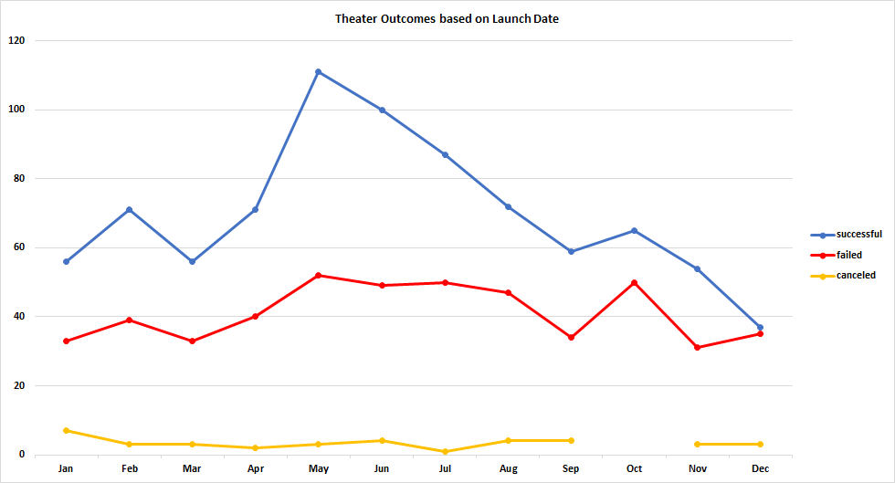
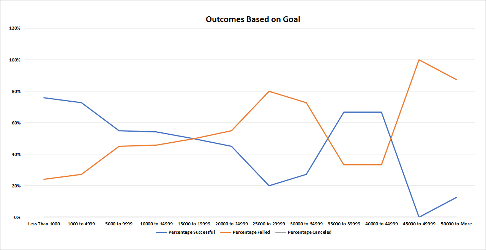

# Kickstarter Analysis

## <u>Overview of Project</u>
Louise is interested in theater and plays. She asked us to help her succeed with her kickstarter campaign. After successfully helping her, she now wants to know more about other campaigns similar to hers.
In order to do that, we will first filter out all campaigns that are in the plays subcategory and observe if there is any correlation between date and outcome. Then, we will take a look at goals and their outcome. Lastly, we will present the data we have found, talk about difficulties and limitations of the dataset, while suggesting additional methods to further our data analysis.

### <u>Purpose</u>
Louise wants to know if there is any correlation between kickstarter campaigns' launch dates, outcomes, and their funding goals.

## <u>Analysis and Challenges</u>

A quantitative analysis was performed on Kickstarter campaigns ranging from 2009 to 2017 across the globe. To get a better understanding of the data at hand, this report will focus on theaters and plays only. In particular, we want to find out if the starting date plays a role in the outcome of the kickstarter campaign. And, whether or not the amount set as goal has any influence on the success or failure of a campaign. Lastly, we will discuss limitations and difficulties within the dataset and what that entails for our results.

### <u>Analysis of Outcomes Based on Launch Date</u>

After analyzing the data, there is a grand total of 1369 theater/plays campaigns of which 839 succeeded, 493 failed, and 37 canceled in the span of 8 years. Most campaigns that succeeded, as can be seen in the above image, were started in May or June. However, campaigns that started in December had a the highest failed to successful ratio, making it the worst month to start a campaign. Therefore, one can conclude that May and June are the best months to start a kickstarter campaign.

### <u>Analysis of Outcomes Based on Goals</u>

Kickstarter campaign goals ranged from less than $1,000 to more than $50,000. Only looking at the theater/plays subcategory, the total number of projects is 1047. Projects that see a higher success rate have campaign goals set to less than $1,000, closely followed by campaigns within a range of $1,000 to $4,999. On the other hand, projects with goals between the $25,000 to $29,999 range saw a higher failure rate. Furthermore, campaigns with $50,000 or more had the highest failure rate.  This can all be seen in the following chart.

Unfortunately, the sample size of projects, after the $15,000 to more range, is too small to determine whether or not a project is more likely to fail or succeed within that range.

### <u>Challenges and Difficulties Encountered</u>

While going through the dataset it was important to isolate outliers and/or remove insufficient data from our analysis. For example, one could easily conclude that the $35,000-$44,999 range is worth pursuing, since the failure rate is only 33%. However, the total number of projects is far too small for that range, making it difficult to accurately predict or recommend.

Another challenge is that the data provided in the "Theater_Outcomes_vs_Launch" line chart is that it only shows cummulative data over 8 years. A more accurate way would be to compare the peaks and throughs on a year to year basis. This would help us narrow down if May is indeed the best month to start a campaign.

## <u>Results</u>

<!--What are two conclusions you can draw about the Outcomes based on Launch Date?--->
- Based on the data provided at hand, we can deduce that campaigns that started in May and June have the highest likelihood of success. On the contrary, campaigns that started in December have the highest chance of failure. Therefore, Louise should start her campaign in May. Unfortunately, there is no correlation between Outcomes and Launch date.

<!--What can you conclude about the Outcomes based on Goals?-->
- Campaigns that had their goals set to less than $4,999 overall had the best chance to succeed. Therefore Louise should stay within that range in order to maximize the chance of reaching her goal. Also, there is a negative correlation between outcomes based on goals.

<!--What are some limitations of this dataset?-->
- Although the theater and plays category contains about 33% of total campaigns within the 8-year period, the whole dataset is incomplete or insufficient. Only projects in the plays subcategory with an outcome goal set to less than $15,000 can be significantly used for our data analysis. Furthermore, we do not know why most projects did not get fully funded.

<!--What are some other possible tables and/or graphs that we could create?-->
- One could analyze the ratio of how many people pledged vs outcome. Goals are important, however, user interaction and project rewards may be even more important. If projects offer less incentives for backers to be proactive, that could be an indication of the quality of the project. Looking at pledged amount vs outcome may also yield better insight into the success of a project. Did the project barely reach its goal, or was it funded 7000% over? Learning more about the individual projects that succeeded would further our data analysis.
